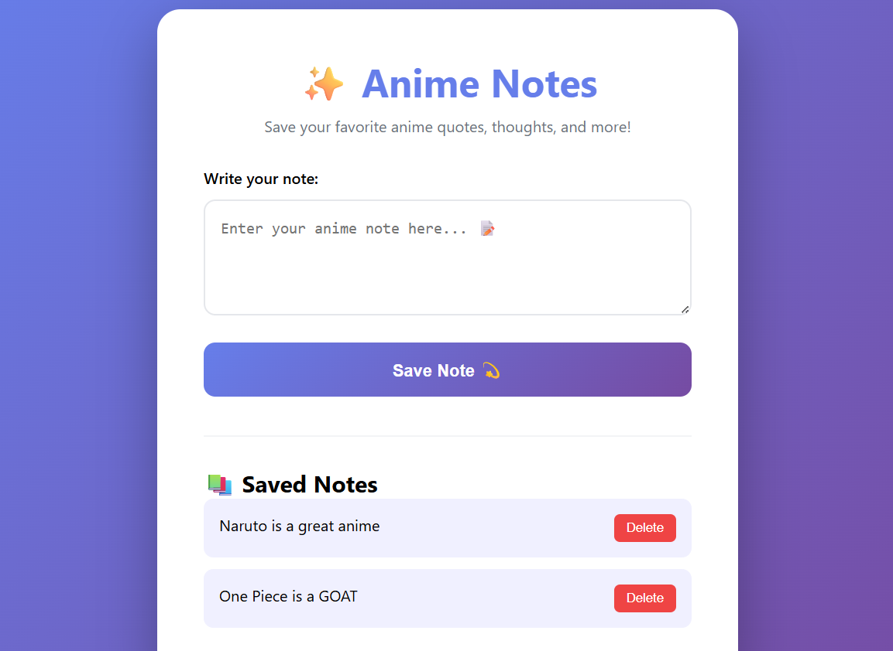
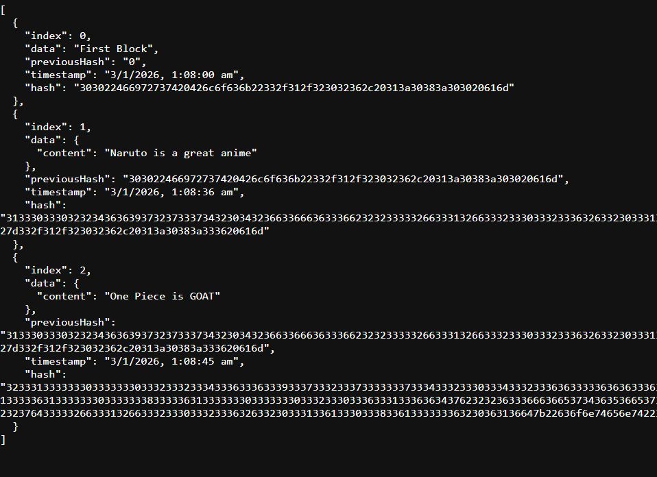

<p align="center">
  
</p>

<h1 align="center">🏴‍☠️ Workshop_Blockchain_demo</h1>

<p align="center">
  <b>“If you don’t take risks, you can’t create a future.”</b><br>
  — Monkey D. Luffy
</p>

<p align="center">
  ⚓ A One Piece–themed journey into Blockchain & Vibe Coding ⚓
</p>

---

## 🎶 Opening Theme – Set Sail 🏴‍☠️

<p align="center">
  <a href="https://youtu.be/YoeP9w5UIlg?si=mv8L7R8sdhLDlA7f"></a>
</p>

---

## 🌊 The Grand Line Objective

This repository is a **hands-on educational blockchain demo project** created for a **university-level workshop**.

Just like the Straw Hat Pirates:
- 🧭 We **build from scratch**
- 🤝 We **trust the crew**
- 🔒 We **protect our data**

This project demonstrates how a **vibe-coded frontend** sails smoothly with a **Node.js–powered blockchain backend**.

Designed for **FY–TY students** — no prior blockchain experience needed.

---

## 🧭 Workshop Mission

By the end of this journey, students will:

- 🧠 Understand **how blockchain works internally**
- 🔗 Learn **client–server communication**
- 🎨 Experience **vibe coding (UI-first development)**
- 🛡️ Use blockchain as a **trust layer**, not cryptocurrency

> ⚠️ This is an **educational blockchain demo**  
> ❌ No crypto  
> ❌ No mining  
> ❌ No wallets  
> ✅ 100% academic & lab-safe

---

## ⚙️ Core Powers (Key Concepts)

- 📦 Block structure (data, hash, previous hash)
- 🔒 Blockchain immutability
- 🔁 Backend API integration
- 💾 LocalStorage vs Blockchain storage
- 🧪 Safe blockchain simulation using JavaScript

---

## 🖼️ Log Pose Snapshots (Project Screenshots)

### ⚓ Frontend Ship Deck (Vibe-Coded UI)



---

### 🧱 Poneglyph Records (Blockchain Output)



---

## 🛠️ Weapons & Tools Used

- **HTML, CSS, JavaScript** – Frontend
- **Node.js** – Backend runtime
- **Express.js** – Server framework
- **CORS** – Cross-origin request handling
- **LocalStorage** – UI persistence
- **Custom Blockchain Logic** – Educational blockchain

---

## 🚀 How to Start the Voyage

### 1️⃣ Install Dependencies
```bash
npm install
````

### 2️⃣ Start the Blockchain Engine

```bash
node server.js
```

### 3️⃣ Open the Frontend

* Open `index.html` directly
* OR use **Live Server** in VS Code

### 4️⃣ Verify the Treasure 🏆

```bash
http://localhost:3000/chain
```

## 🔗 Straw Hat Strategy (System Flow)

```
User Input
   ↓
Frontend (Vibe Coding)
   ↓
Node.js Server
   ↓
Blockchain Logic
   ↓
Block Added with Hash
```

---

## 🧑‍🏫 Workshop Usage

Used as a **live demo** where students build:

* 📋 Attendance System
* 🗒️ Notes Vault
* 🎓 Certificate Storage
* 📄 Resume Verification

---

## 👑 Captain of the Crew

**Jeevan Jadhav**
Workshop Speaker & Facilitator
🧠 *Blockchain Fundamentals*

---

<p align="center">
  ⚓ <b>Set Sail. Build Trust. Write Code.</b> ⚓
</p>
